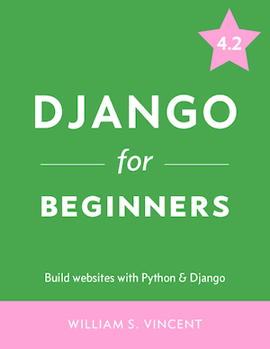

# Django for Beginners

This is the code repository for [Django for Beginners](https://djangoforbeginners.com/), written by [William Vincent](https://wsvincent.com). It contains all the supporting project files necessary to work through the book from start to finish.

## About the Book
__Django for Beginners__ is a comprehensive guide to building modern Python web applications with Django. The book proceeds step-by-step through seven increasingly complex apps, covering Django fundamentals--models, views, URLs, templates--and more advanced topics such as APIs, user authentication, testing, deployment, forms, permissions, security, and performance. You'll learn how to solve common problems, implement best practices, and leverage Django's powerful third-party package ecosystem.

After reading this book, you will have a solid understanding of how Django works and the ability to build real-world, advanced web applications in a short amount of time. 

## Requirements
This book requires Python 3.11+ and Django 4.2.

## Django Projects
The book covers a wide range of web development and Django topics across five different projects:

- __Initial Set Up__ (chapter 1):
    - Properly configure a Windows or macOS computer for Django development
    - Introduction to the Command Line and basic Shell commands
    - Correctly install Python 3.11
    - Guide to Python virtual environments
    - How to install Django to the latest version (4.2)
    - Text editor bonus configurations for improved workflow
    - First Django project
    - Install and configure Git for use throughout the book
- __Hello World Application__ (chapter 2):
    - Comprehensive overview of how websites work under-the-hood
    - Introduction to web frameworks
    - (MVC) Model-View-Controller vs (MVT) Model-View-Template
    - Create an app with views and URLs
    - Learn how to create a `requirements.txt` file and store code on GitHub
- __Pages Application__ (chapter 3):
    - Build views, URLs, and template files
    - Explore Class-Based-Views
    - Learn how to extend templates, using a base file
    - Add robust tests for all new functionality
    - Deployment checklist to switch from local development to production
    - Deploy the website via Fly.io
- __Message Board Application__ (chapters 4-5):
    - models...

- __Blog Application__ (chapters 6-9):
    - Implement authentication using the Django authentication framework

- __Newspaper Application__ (chapters 10-17):

## Source Code for Previous Editions
- [4.0 version repo](https://github.com/wsvincent/djangoforbeginners_40)
- [3.2 version repo](https://github.com/wsvincent/djangoforbeginners_32)
- [3.1 version repo](https://github.com/wsvincent/djangoforbeginners_31)
- [3.0 version repo](https://github.com/wsvincent/djangoforbeginners_30)