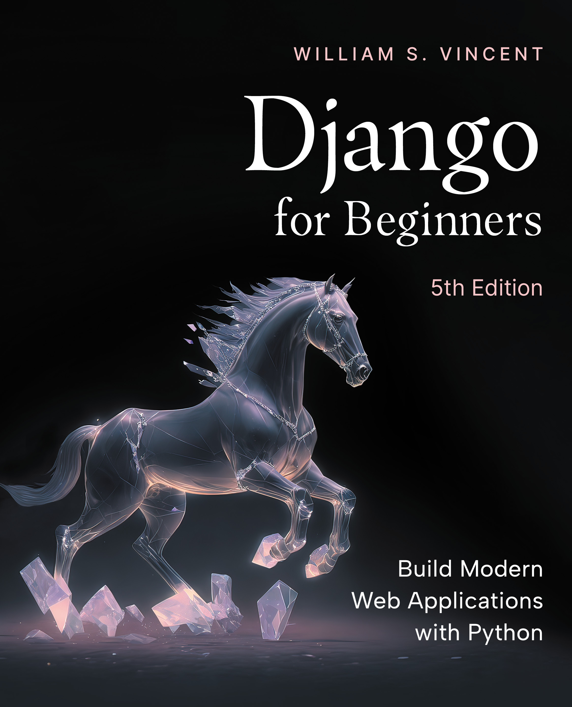

# Django for Beginners

This is the code repository for [Django for Beginners](https://djangoforbeginners.com/), written by [William Vincent](https://wsvincent.com). It contains all the supporting project files necessary to work through the book from start to finish.

## About the Book
__Django for Beginners__ is a comprehensive guide to building modern Python web applications with Django. The book proceeds step-by-step through six increasingly complex apps, covering Django fundamentals--models, views, URLs, templates--and more advanced topics such as APIs, user authentication, testing, deployment, forms, permissions, security, and performance. You'll learn how to solve common problems, implement best practices, and leverage Django's powerful third-party package ecosystem.

After reading this book, you will have a solid understanding of how Django works and the ability to build real-world, advanced web applications in a short amount of time. 

## Source Code for Previous Editions
- [4.2 version repo](https://github.com/wsvincent/djangoforbeginners_42)
- [4.0 version repo](https://github.com/wsvincent/djangoforbeginners_40)
- [3.2 version repo](https://github.com/wsvincent/djangoforbeginners_32)
- [3.1 version repo](https://github.com/wsvincent/djangoforbeginners_31)
- [3.0 version repo](https://github.com/wsvincent/djangoforbeginners_30)